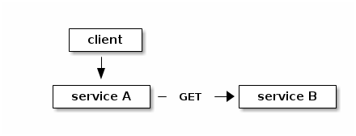
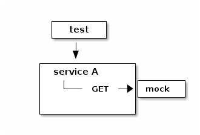
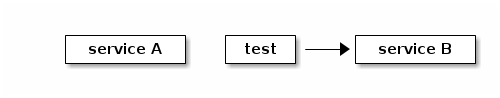
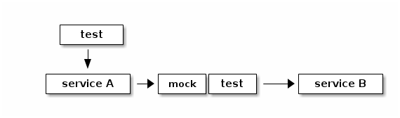
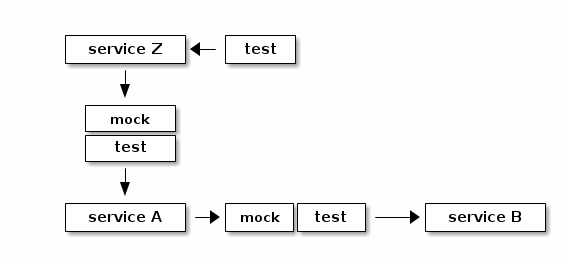
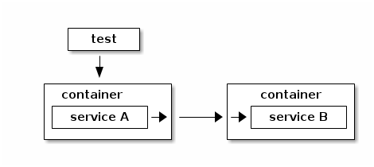
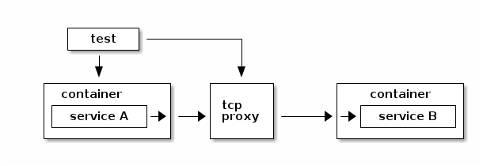

:title: debt-services-devconf16
:css: css/style-fedora.css
:data-transition-duration: 500
:skip-help: true
:hovercraft-path: m275,175 v-150 a150,150 0 0,0 -150,150 z

----

Refinance your technical debt
=============================
with microservices
------------------

Presented at `DevConf 2016 <http://devconf.cz>`_ by `@ralphbean <http://threebean.org>`_.

Slides available at http://threebean.org/presentations/debt-services-devconf16/

.. image:: images/fedmsg-flock14-img/creative-commons.png

----

Let's talk about
================
technical debt
--------------

Invest in infrastructure credit-default-swaps to hedge against
toxic CSS assets?

Avoid negative amortization by liquifying our deployment portfolio?

**No** -- We're talking about a series of bad decisions where we end up using more
resources to accomplish less.

----

code smells
===========
(qualitative evaluation)
------------------------

- duplicated code (fas caching, openid client login, ...)
- long methods and large classes (supybot-fedora, ...)
- contrived complexity (fedbadges, ...)
- half-implemented features (datagrepper, ...)
- no or poor documentation (releng scripts, ...)
- commented out code? or incorrect comments!
- no tests? or broken tests! (anitya, ...)
- parts that no one wants to touch (python-fedora, FAS?, ...)
- does hacking on it feel good or bad?

----

the alpha
=========

- not knowing how to say **NO** to features
- "I'll take the shortcut and clean up the mess tomorrow" (٭°̧̧̧ω°̧̧̧٭)
- when the priority is pushing code over good design and reusability

  - "I want to be seen as a good hacker!"

- We tend to celebrate "new" work over tedious maintenance.

----

the omega
=========

- At the end of a dev cycle, we have one more fragile thing.

- Even worse, future dev cycles *and* deployments take longer and involve
  more fear.

- Can produce fatigue, cynicism and delusional self-efficacy: a culture of despair.

  - In the end, this is the real thing we should be concerned with avoiding.

----

What's a talk
=============
without numbers?
----------------

Can we quantify our revulsion to take responsibility for code?

----

Consider
========
lead time
---------

Ideally, measuring the time from when features are committed to
when they are released **in production**.

For Fedora Infrastructure, we can only measure the time from when
feature are committed to when they are released as a git tag.

Here's a random subset of the repos on my dev box with the
**average** lead time calculated. There are **all kinds** of
caveats to this calculation, so take these results with a
tablespoon of salt.

----

the good
========

+-----------------------------------+---------+
| pagure                            | 2 days  |
+-----------------------------------+---------+
| mote                              | 2 days  |
+-----------------------------------+---------+
| pkgdb2                            | 5 days  |
+-----------------------------------+---------+
| fedora-releng-dash                | 5 days  |
+-----------------------------------+---------+
| anitya                            | 7 days  |
+-----------------------------------+---------+
| fedmsg_meta_fedora_infrastructure | 9 days  |
+-----------------------------------+---------+
| fmn.rules                         | 13 days |
+-----------------------------------+---------+
| tahrir-api                        | 14 days |
+-----------------------------------+---------+
| fmn.lib                           | 15 days |
+-----------------------------------+---------+
| fmn.consumer                      | 16 days |
+-----------------------------------+---------+
| the-new-hotness                   | 18 days |
+-----------------------------------+---------+
| datanommer                        | 19 days |
+-----------------------------------+---------+
| fedocal                           | 19 days |
+-----------------------------------+---------+
| fmn.web                           | 20 days |
+-----------------------------------+---------+

----

the bad
=======

+--------------------+---------+
| fedmsg             | 23 days |
+--------------------+---------+
| tahrir             | 31 days |
+--------------------+---------+
| blockerbugs        | 34 days |
+--------------------+---------+
| bodhi              | 38 days |
+--------------------+---------+
| fedora-tagger      | 38 days |
+--------------------+---------+
| resultsdb_api      | 41 days |
+--------------------+---------+
| fas                | 43 days |
+--------------------+---------+
| packagedb-cli      | 43 days |
+--------------------+---------+
| resultsdb_frontend | 46 days |
+--------------------+---------+
| datagrepper        | 51 days |
+--------------------+---------+

----

the ugly
========

+-------------------+--------------+
| resultsdb         | 51 days      |
+-------------------+--------------+
| **nuancier**      | 52 days      |
+-------------------+--------------+
| fedbadges         | 62 days      |
+-------------------+--------------+
| python-fedora     | 67 days      |
+-------------------+--------------+
| supybot-fedora    | 67 days      |
+-------------------+--------------+
| koji              | 90 days      |
+-------------------+--------------+
| sigul             | 94 days      |
+-------------------+--------------+
| fedora-packages   | 115 days     |
+-------------------+--------------+
| kitchen           | **181 days** |
+-------------------+--------------+

----

What
====
do?
---

----

Cultural practices
==================

Moral high-horse stuff:

- Don't let it happen in the first place
- "Always leave the codebase cleaner than when you found it"

Institutions:

- Code review (we do this).
- No features without a test, without docs.
- I like the idea of devoting a week every two months where we all do
  only technical debt fighting.  Or some other scheme: have a rotating
  person every week?

----

Architectural practices
=======================

Consider **microservices**:  an architectural style where single applications
are developed as a suit of small services.

It started becoming a hot topic in 2014, but the 2015 google search stats are
through the roof.

Tangentially, the pattern is of interest to us with respect to platform
development generally (that's our business).  It is unclear if the popularity
of microservices is driving the interest in containerization or if the
popularity of containerization is driving interest in microservices.
Continuous integration, continuous deployment, immutable infrastructure --
these are all mutually reinforcing industry trends.

----

Characteristics
===============
of microservices
----------------

- **componentization via services**:
  Obviously, we modularize stuff all the time.
  Compare this with componentization via libraries.
- **organized around "business capabilities"**:
  In enterprise organizations, think "billing" versus "shipping" versus "payroll".
  We're more or less on the ball with this, except for some outliers.
  Think of **wikitcms**.
- **smart endpoints, dumb pipes**:
  Think fedmsg!  Contrast with ESB (egregious spaghetti box).
  Compare with The Internet.
- **decentralized government**:
  The idea is that you can choose the right tool for the job.
  We do our own (healthy) version of this.  No mandate on platform, framework, etc..
- **decentralized data management**:
  This is one of Amazon's famous rules.
  We mostly have this.  Some of our services communicate through the same DB.
- **infrastructure automation (and application telemetry!)**:
  Necessary to keep track of all the new services. We're now dynamically
  creating fedmsg endpoints but we could do nagios monitoring, iptables
  rules, etc.
- **design for failure**:
  Think of Netflix's famous "Chaos Monkey".
  We're mixed in this regard.
  For instance, fedmsg fails gracefully but think where bodhi1 fails when
  fas gets loaded.  There are plenty of other examples.
- **evolutionary design**:
  This is a cop off from the Agile development handbook.
  We're mixed in this regard, but mostly on point.

----

How Big
=======
is a microservice?
------------------

- one responsibility? (how about payroll? that's big)
- small enough to fit in my head?
- small enough to rewrite in 2 weeks.

----

Cultural Patterns
=================
for deployment
--------------

- you built it, you run it
- google has a "hand back to dev" bit in their policy
- required production telemetry for every feature(!) (think, graphs of logins)

----

Case Studies
============

On one hand:

  - **old pkgdb**
  - **FAS**
  - **bodhi**

On the other:

  - **old pkgdb** + fedora-tagger + appdata
  - **koschei**
  - **FMN**

----

Pre-requisites
==============
(generally speaking)
--------------------

- **automated tests**: These are par for the course, but can we do better?
- **rapid provisioning**: We don't have, but its getting better.
- **rapid application deployment** (playbooks/manual/upgrade/\*.yml), We're getting better here.
- **monitoring** (platform and application): We have, but it's not automatic (yet).
- **devops culture** (We're lucky to have inherited this from the past).

----

focus for a moment
==================
on testing strategies
---------------------

- **component** testing
- **integration** testing
- **contract** testing
- **end-to-end** testing

----

contract-based testing
======================

Recall that your services interact with each other on the backend.

----

but we don't want that
======================
so we mock out interfaces
-------------------------

This is standard practice, but it generates new problems.

----

service B has its own tests
===========================
(and we put a lot of work into it)
----------------------------------

----

we could re-use the knowledge
=============================
in that test suite
------------------

----

this extends
============
to consumers of service A
-------------------------

----

using containers
================
for integration testing
-----------------------

----

manipulate proxy
================
to simulate network failure
---------------------------

----

A hypothetical toolchain
========================
for continuous deployment?
--------------------------

git repos to jenkins to dgroc to copr to $SYSTEM to ansible to staging to rube

- would require that we get jenkins up-to-snuff
- would require a policy change to allow copr on infra (which we've
  begun to do in practice - but we need to revisit this).
- would require $SYSTEM to be written
- would require upgrade playbooks where we don't have them.
- would require an arithmetic amount of work to get all our services
  ready in git, jenkins and ansible

----

this sounds like a lot of work
==============================
so, why bother?
---------------

- New test frameworks?  playbooks?  jenkins?  That is not insignificant work.
- Let's not get caught up in "microservices envy".
- "Webscale", yes.  But this is not our particular problem.
- Scaling with respect to developer cognitive resources.

  - "Locality" of code assessment and well defined boundaries help.

----

A last word
===========
on complexity
-------------

(Keep in mind that working on the pre-requisites is good for you anyways.)

- We get **strong boundaries**, simpler subsystems, independance, and opportunity for tech diversity.
- At cost of new systems-level problems: performance, data consistency, and ops complexity.

Furthermore,

- There is a supposed **initial investment** in code complexity.  But, consider mdapi?
- However, there is a supposedly **reduced attenuation of productivity** with respect to base complexity.  But is there?

Perhaps you are required to build a monolith first to learn your lessons in
practice -- where do boundaries make the most sense?

----

Refinance your technical debt
=============================
with microservices
------------------

Presented at `DevConf 2016 <http://devconf.cz>`_ by `@ralphbean <http://threebean.org>`_.

Slides available at http://threebean.org/presentations/debt-services-devconf16/

.. image:: images/fedmsg-flock14-img/creative-commons.png
