:title: factory2-devconf17
:css: css/style-redhat.css
:data-transition-duration: 700
:skip-help: true
:hovercraft-path: m275,175 v-150 a150,150 0 0,0 -150,150 z
 
----

The Productization Pipeline
===========================
and the so-called "Factory 2.0"
-------------------------------

Presented at `DevConf 2017 <https://devconf.cz>`_ by `@ralphbean <http://threebean.org>`_.

Slides available at http://threebean.org/presentations/factory2-devconf17/

.. image:: images/fedmsg-flock14-img/creative-commons.png

----

The Eternal September
=====================

A fun tidbit of *Hacker Lore*:

  Also called the **September that never ended**, the **Eternal September** is
  *Usenet slang* for a period beginning in September 1993, the month that
  Internet service provider America Online began offering Usenet access to its
  many users, overwhelming the existing culture for online forums.

----

:data-x: r0
:data-y: r900

The Second Eternal September
============================
and the rise of github
----------------------

.. image:: images/factory2-flock16-img/packages.png
   :width: 700px

This is fine.

----

Consequent Changes
==================

To *application development and deployment*:

``pip freeze > requirements.txt  # ship it!``

In my opinion, `Modularity <https://fedoraproject.org/wiki/Modularity>`_ is
our attempt to address this.

Our entire toolchain grew up in a time when this modularity stuff was neither possible nor desirable.

----

:data-x: r1600
:data-y: 0

What even is this
=================
"Factory 2.0"?
--------------

You can read our `design documents
<https://fedoraproject.org/wiki/User:Ralph/Drafts/Infrastructure/Factory2>`_
for the long-winded *vision*.

It's an umbrella initiative for fixing chronic problems that span the
build-to-release pipeline.

For today, I want to focus on:

- **Measurements**
- **Continuous Integration**
- **Modularity**

----

:data-x: r1600
:data-y: 0

The existing pipeline
=====================
idealized
---------

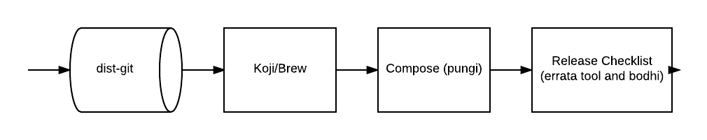

----

:data-x: r0
:data-y: r900

really
======
it's more like
--------------

.. image:: images/factory2-devconf17-img/this-is-fine.gif

----

but,
====
let's just pretend
------------------

----

:data-x: r1600
:data-y: 0

to start with:
==============
measurements
------------

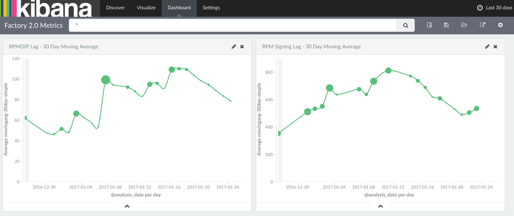

----

:data-x: r0
:data-y: r900

it's getting complicated,
=========================
real quick
----------

For example, one of our *overall* goals is to be able to get content into containers as quickly and painlessly as possible.

Consider measuring the delay for that.  It makes my head spin!

----

:data-x: r1600
:data-y: 0

continuous integration
======================
today
-----

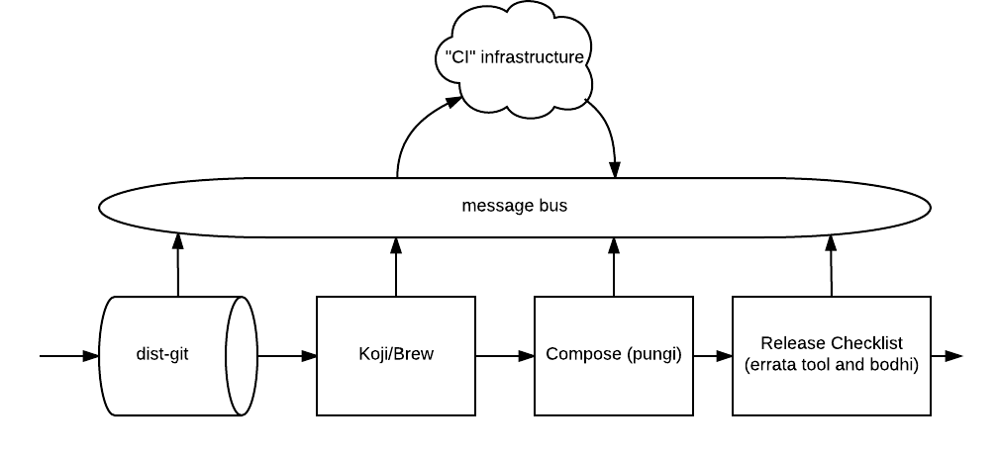

What problems do we have here?

----

:data-x: r0
:data-y: r900

a first step
============
resultsdb
---------

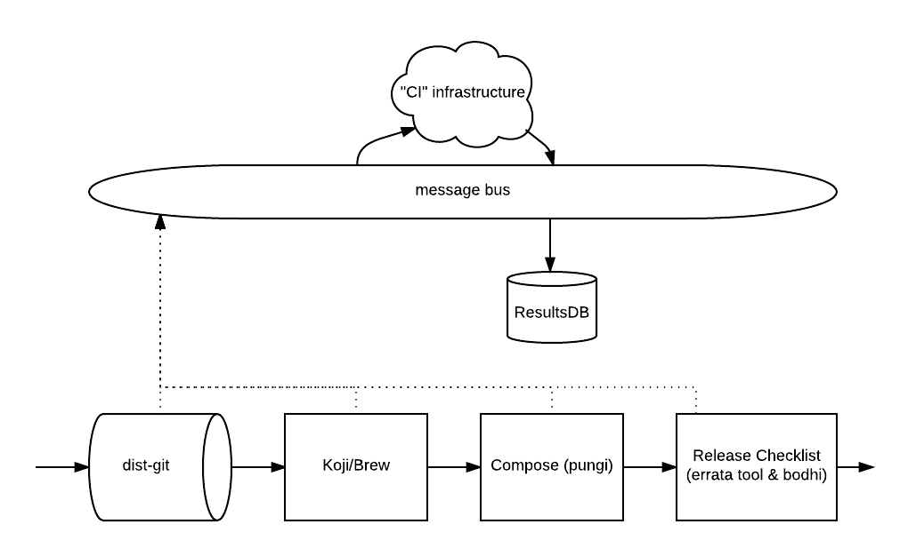

----

some more detail
================
on the data feed
----------------

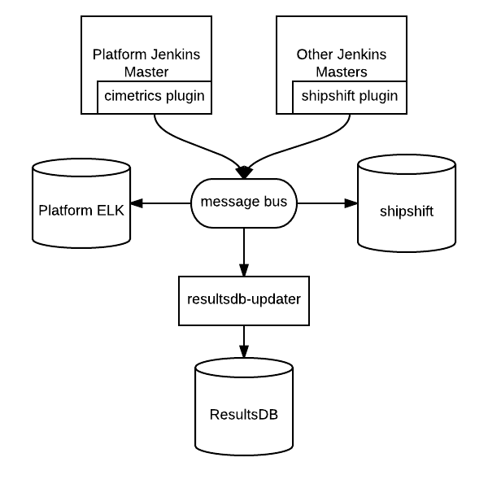

----

putting resultsdb
=================
to use
------

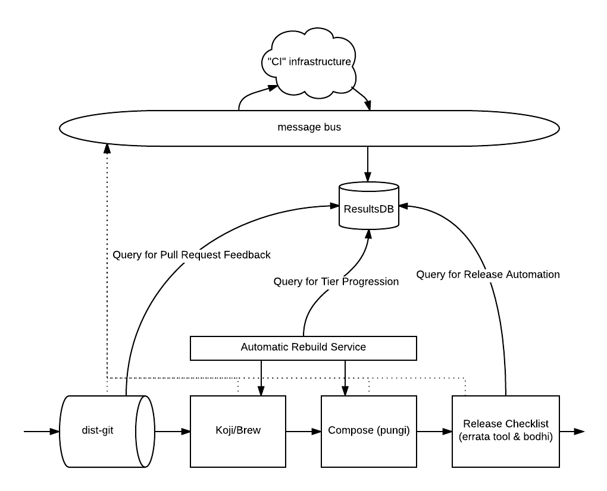

----

but what if
===========
the machines are wrong?
-----------------------

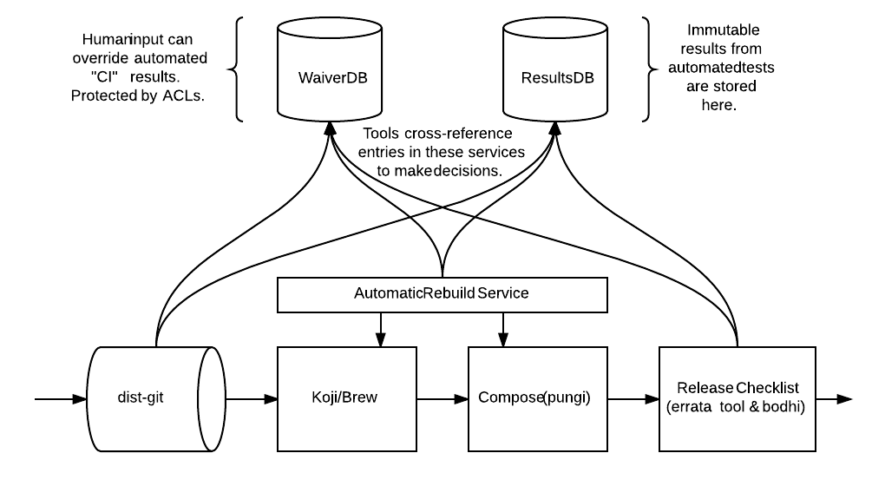

----

not entirely
============
sufficient
----------

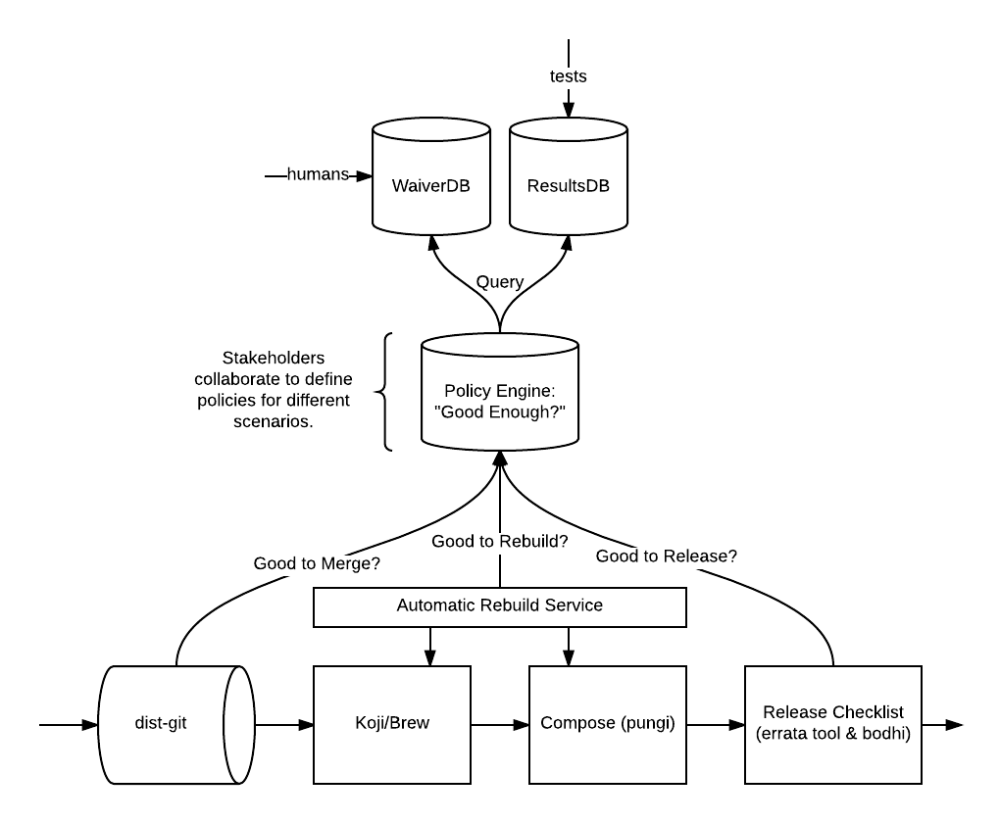

----

the "interface"
===============
for CI
------

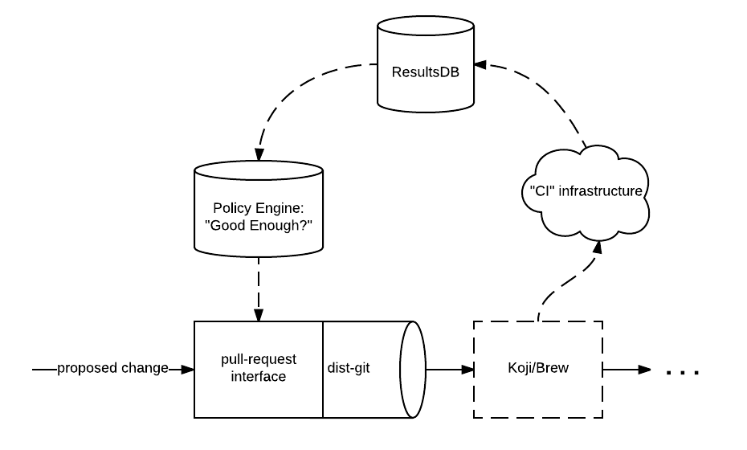

----

:data-x: r1600
:data-y: 0

building modules
================
(new topic)
-----------

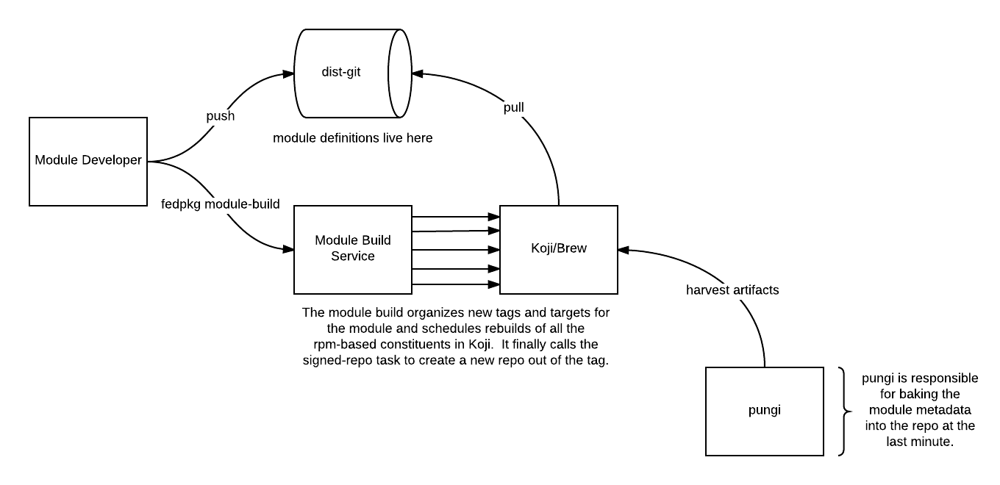

----

:data-x: r0
:data-y: r900

buildroots,
===========
today
-----

.. image:: images/factory2-devconf17-img/builds-and-buildroots.png

----

buildroots,
===========
with modules
------------

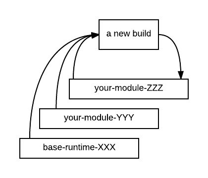

----

containers
==========
from modules
------------

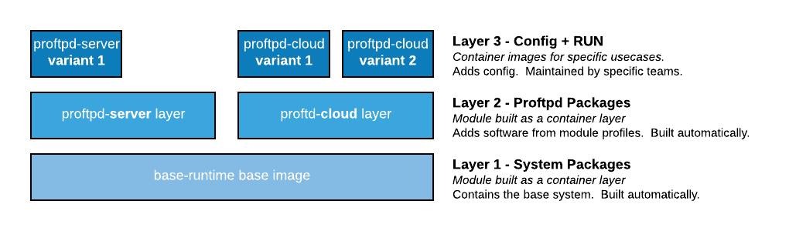

----

let's talk about...
===================

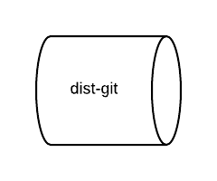

----

branching,
==========
today
-----

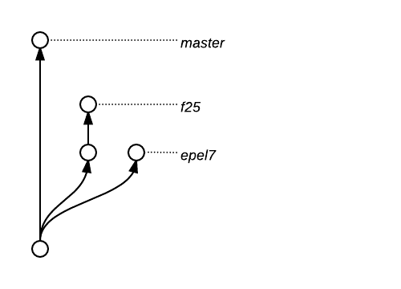

----

branching,
==========
tomorrow
--------

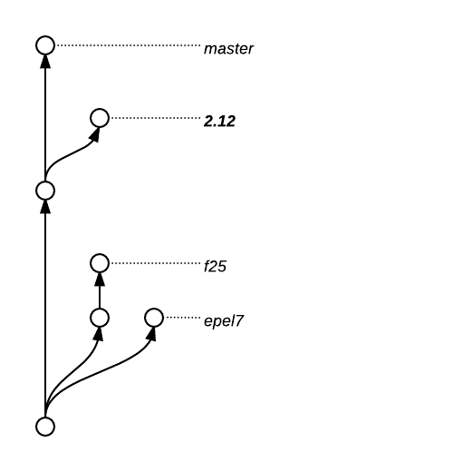

----

branching,
==========
with rhel
---------

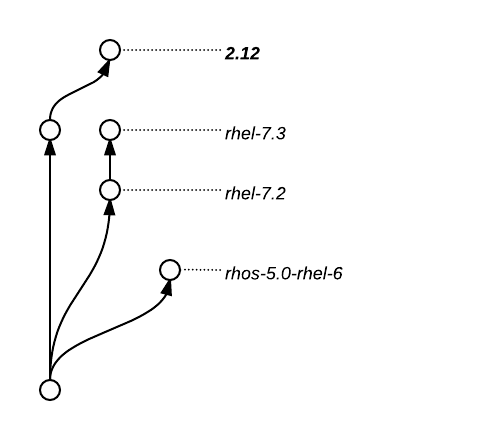

----

branching,
==========
with modules
------------

.. image:: images/factory2-devconf17-img/branching-with-modules.png

----

Lots to think about
===================
with a new branching structure
------------------------------

- Will there ever be a **f27 branch**?
- What about **EOLs** for these new world branches?
- What's the *economic force* that will generate new branch requests?
- Is the module's EOL the *minimum of the union* of its component EOLs?
- If all active branches of a component go EOL, do we automatically retire it?

----

:data-x: r1600
:data-y: 0

lots to think about
===================
lots to do
----------

**Thank you!**

Presented at `DevConf 2017 <https://devconf.cz>`_ by `@ralphbean <http://threebean.org>`_.

Slides available at http://threebean.org/presentations/factory2-devconf17/

Hop in ``#fedora-modularity`` to join the party (we share it with the modularity team).

.. image:: images/fedmsg-flock14-img/creative-commons.png
