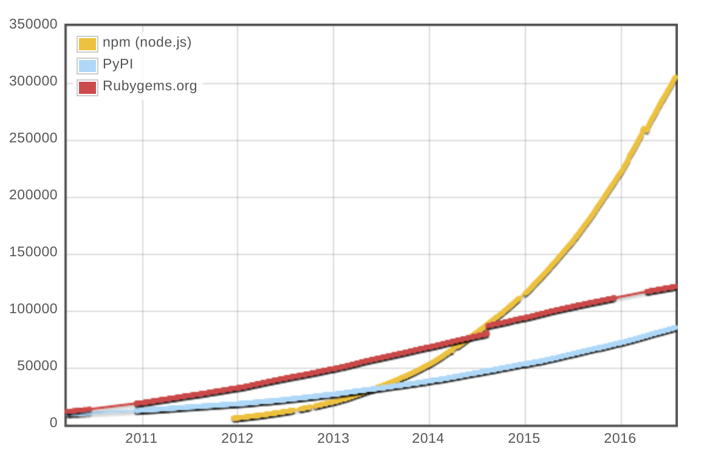
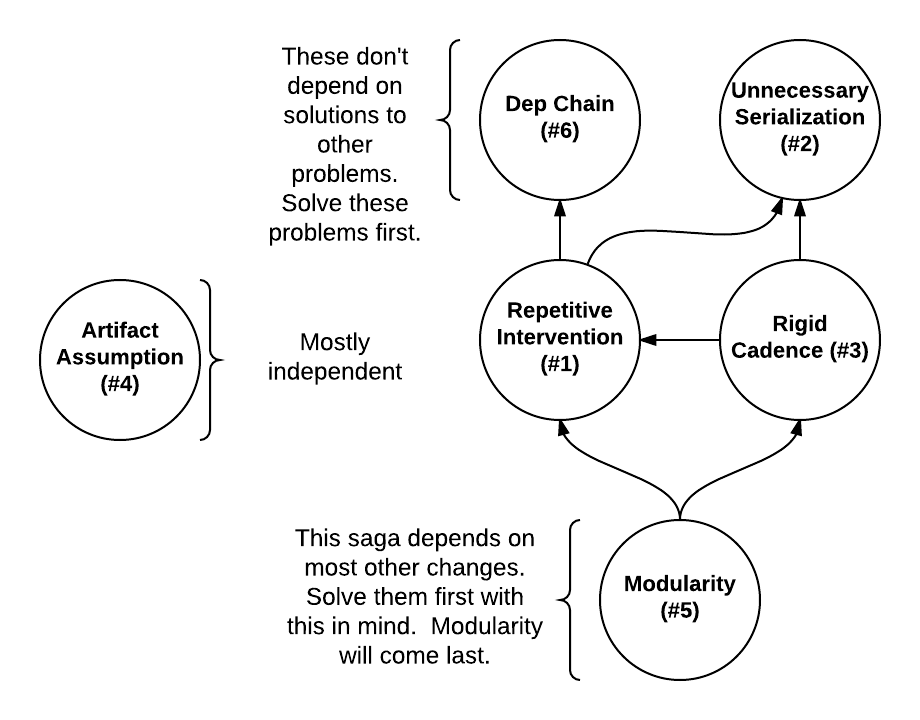
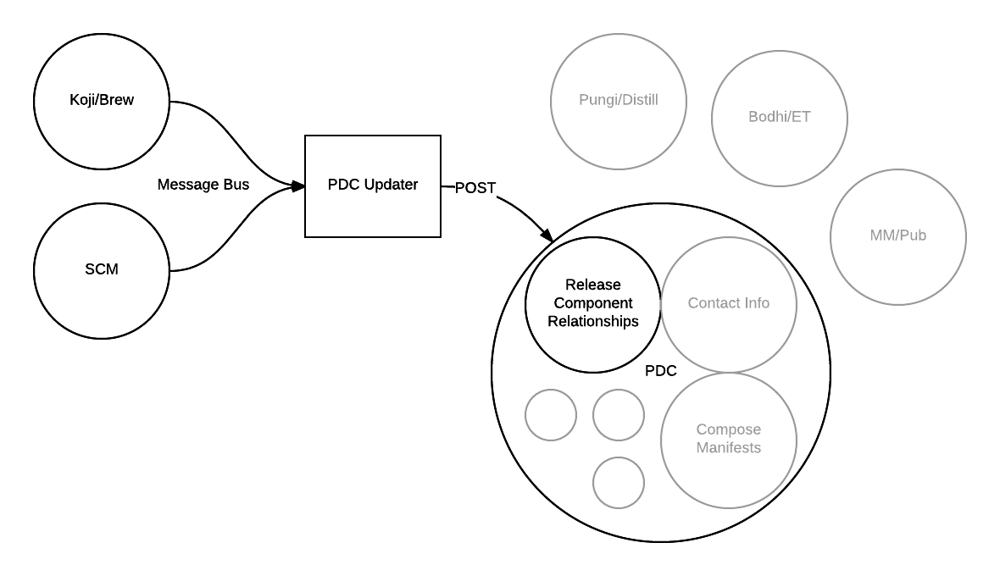
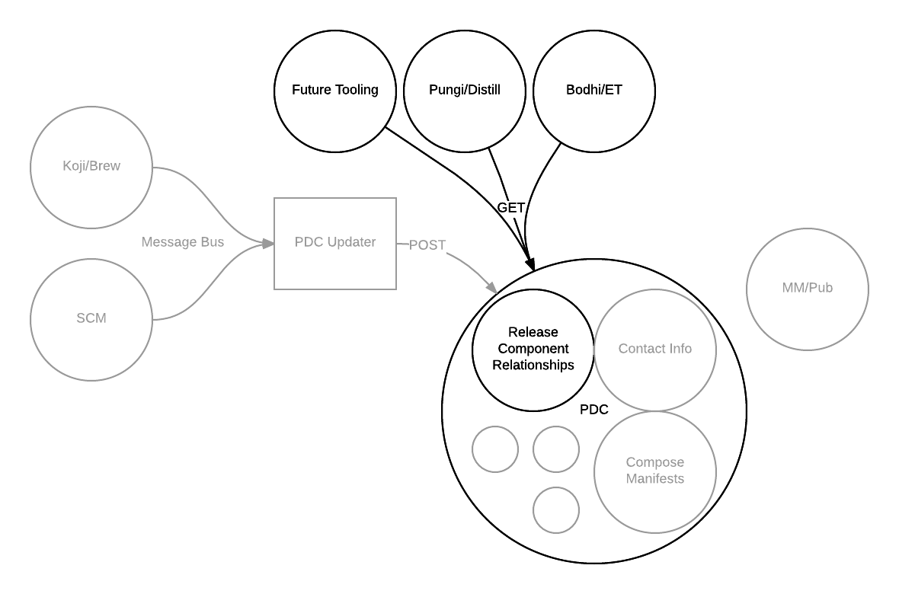
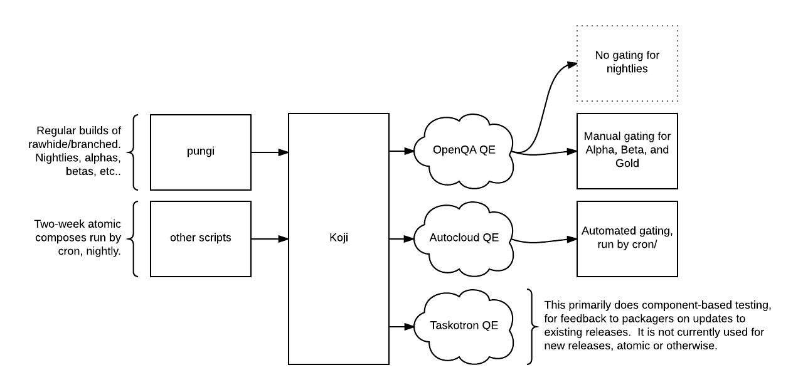
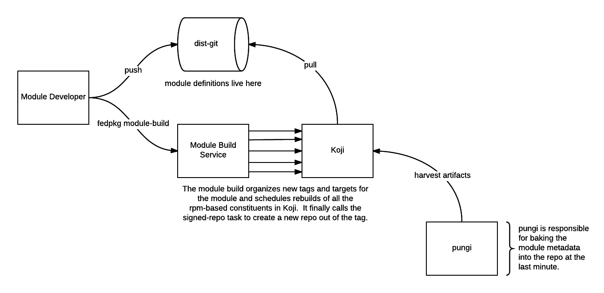
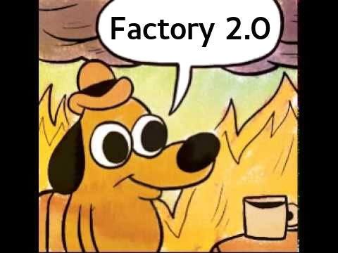

:title: factory2-flock16
:css: css/style-fedora.css
:data-transition-duration: 700
:skip-help: true
:hovercraft-path: m275,175 v-150 a150,150 0 0,0 -150,150 z
 
----

The so-called "Factory 2.0"
===========================

Presented at `Flock 2016 <https://fedoraproject.org/wiki/Flock_2016>`_ by `@ralphbean <http://threebean.org>`_.

Slides available at http://threebean.org/presentations/factory2-flock16/

.. image:: images/fedmsg-flock14-img/creative-commons.png

----

The Eternal September
=====================

A fun tidbit of *Hacker Lore*:

  Also called the **September that never ended**, the **Eternal September** is
  *Usenet slang* for a period beginning in September 1993, the month that
  Internet service provider America Online began offering Usenet access to its
  many users, overwhelming the existing culture for online forums.

----

:data-x: r0
:data-y: r900

The Second Eternal September
============================
and the rise of github
----------------------

This is fine.

----

Consequent Changes
==================

To *application development and deployment*:

``pip freeze > requirements.txt  # ship it!``

To the *traditional linux distribution*:

- nixOS
- coreOS
- docker and friends

----

:data-x: r1600
:data-y: 0

"Modularity",
=============
briefly
-------

- Matthew Miller `started the conversation <https://mattdm.org/fedora/2013next/#1>`_ a few years ago.
- This has alternatively been called "Fedora Rings", "Envs and Stacks", and `Alephs
  <https://fedoraproject.org/wiki/Env_and_Stacks/Projects/PackageReviewProcessRedesign>`_.
- Red Hat is now funding a team to see what we can do(!)
- Watch the recording of Langdon's talk that was here in this room just before lunch for the scoop.

----

:data-x: r1600
:data-y: 0

But first,
==========
How not to throw things over the wall
-------------------------------------

- In past Flocks we've talked about how to articulate "Red Hat things" in the
  Fedora space.
- I work for a group in Red Hat called **PnT DevOps**.

  - Fedora Packagers **⇒** RH Platform Engineering.
  - Fedora Infra **⇒** RH PnT DevOps.

- Let's be honest, and open.  Let's worry less about "if Fedora is interested" and just share.
- All of this is a two-way street.  Old habits die hard.

----

:data-x: r1600
:data-y: 0

What Factory 2.0 is not
=======================

We had a problem from the outset.  Lots of *myths* started to propagate about "Factory 2.0".

- Factory 2.0 is not **a single web application**.
- Factory 2.0 is not **a rewrite of our entire pipeline**.
- Factory 2.0 is not **a silver bullet**.
- Factory 2.0 is not **a silver platter**.
- Factory 2.0 is not **just Modularity**.
- Factory 2.0 is not **going to be easy**.

----

:data-x: r0
:data-y: r900

the same "thing"
================
under different interpretation
------------------------------

... and why it took us so long to get here.

How long ago was it that we started talking about the Rings proposal?

- Does Modularity mean anything with Factory 2?
- Does Factory 2 mean anything without Modularity?

----

:data-x: r1600
:data-y: 0

the six problem statements
==========================
(we made a list)
----------------

- **Repetitive human intervention** makes the pipeline slow.
- **Unnecessary serialization** makes the pipeline slow.
- The pipeline imposes a rigid and **inflexible cadence** on products.
- The pipeline **makes assumptions** about the content being shipped.
- The distro is defined by packages, not “features” (**Modularity**).
- There’s no easy way to **trace deps** from upstream to product.

----

:data-x: r0
:data-y: r900

----

If we had problems before...
============================
...they're about to get a lot worse.
------------------------------------

- Remember the lego blocks analogy?  `Imagine Modularity without Factory2. <https://twitter.com/DickKingSmith/status/759673972871102464/photo/1>`_

----

:data-x: r1600
:data-y: 0

Dependency Chain
================
Problem Number 6
----------------

**There’s no easy way to trace deps from upstream to product (through all intermediaries).**

- We can model deps of RPMs today, kinda.
- We can model deps of docker containers in OSBS.
- ``productmd`` manifests produced from ``pungi`` contain the deps of all our images.

So, that's great.  But there's no easy way to traverse deps all the way from upstream component to end artifacts.

----

:data-x: r0
:data-y: r900

Let's expand `pdc-updater <https://github.com/fedora-infra/pdc-updater>`_.

----

And then we can use that data for great justice.

----

:data-x: r1600
:data-y: 0

Pipeline Serialization
======================
Problem Number 2
----------------

**Unnecessary serialization makes the pipeline slow.**

This is less a problem for Fedora's Infrastructure than it is for the internal
PnT DevOps environment: things happen, unnecessarily, in serial.

One big piece we (will) share here is the Openshift Build Service (OSBS) for building containers.
We're going to need to crack the ``autosigner.py`` nut to get around new
problems (assuming we "go big" with containers).

Internally we're going to be using a special build key for this -- which we'll
treat as semantically different from the gold key.  Let's consider doing the
same in Fedora.

----

:data-x: r1600
:data-y: 0

Automating Throughput
=====================
Problem Number 1
----------------

**Repetitive human intervention makes the pipeline slow.**

This one can cover a lot of ground.

- Rebuild automation.
- Compose automation.
- Release automation.

----

:data-x: r0
:data-y: r900

Automating Throughput
=====================
Rebuilds and Composes
---------------------

Builds:

- For this we'd like to build a workflow layer on top of koji called "the orchestrator" (or, the build orchestrator).
- The concept was originally confused with modularity-specific considerations, but we'd like it to be more general.

Composes:

- Take pungi and break it out into an *ad hoc* process alongside the buildsystem.
- In the best scenario, compose artifacts are built before we ask for them.

----

Automating Throughput
=====================
Releases
--------

- We can do two-week Fedora Atomic Host releases now.  Hooray!

- Can we reconcile that with the mainline compose/QA/release process?
- The problem is much more intense for Red Hat just due to volume.
- We have uncovered ground in Bodhi for automation.  The karma system is a predecessor, but it relies on humans.  Can we fast-track some components based on taskotron results?
- How can we specify an (automated) policy for setting difference release cadences?  (without hard coding it)

----

:data-x: r1600
:data-y: 0

Flexible Cadence
================
Problem Number 3
----------------

**The pipeline imposes a rigid and inflexible cadence on "products".**

Releases:

- Related to the previous point about Automating Releases.
- In the first analysis, "the pipeline is as fast as the pipeline is."

EOL:

- Think about the different EOL discussions for the different Editions.
- Beyond that - a major goal of modularity is "independent lifecycles".  What does that mean in practice?

Let's talk about pkgdb2 and its ``collections`` model.

----

:data-x: r1600
:data-y: 0

Modularity
==========
All Roads Lead to Rome
----------------------

**The distro is defined by packages, not “features”.**

- There are some specific things about modularity (module build service, BPO, etc...)
- Really, this is where we tie all the threads together.  Each has a certain
  value on its own, but if we can't "do modularity" it won't have the same
  effect.

----

:data-x: r0
:data-y: r900

Building Modules
================

----

- Let's go visit the `Modularity Infrastructure page <https://fedoraproject.org/wiki/Modularity/Infra>`_.
- Then, let's go visit the dev instance of the `build pipeline overview app <modularity.fedorainfracloud.org>`_.

----

:data-x: r1600
:data-y: 0

Artifact Assumptions
====================
Problem Number 4
----------------

**The pipeline makes assumptions about the content being shipped.**

- Remember we asked some Red Hat stakeholders what they wanted out of a next generation pipeline?  There were some real gems in there.
- My favorite was:

    *"I want to be able to build any content, in any format, without changing anything."*

----

:data-x: r0
:data-y: r900

this is fine
============

----

Artifact Assumptions
====================
Problem Number 4
----------------

- This one is an odd duck among the problem statements.  Qualitative - not quantitive.
- Do we have to do gymnastics every time we add a new format?  Or can we make that easier over time.

  - Autocloud and two week atomic
  - OSBS.
  - Flatpak, snaps, rocket containers, etc...

- We can do anything.  But how easily can we do it?
- Which leads us to....

----

:data-x: r1600
:data-y: 0

The pernicious hobgoblin
========================
of technical debt
-----------------

- Microservices (consolidate around responsibility!)
- Reactive services
- **Idempotent** services
- Infrastructure automation

----

:data-x: r1600
:data-y: 0

Thank you
=========

- There's an opportunity to do something *very cool* with how we make the distro.
- Please tell me where I'm wrong.
- Hop in ``#fedora-modularity`` and ``#fedora-admin`` to join the party.

----

:data-x: r0
:data-y: r900

Questions?
==========

Presented at `Flock 2016 <https://fedoraproject.org/wiki/Flock_2016>`_ by `@ralphbean <http://threebean.org>`_.

Slides available at http://threebean.org/presentations/factory2-flock16/

.. image:: images/fedmsg-flock14-img/creative-commons.png
