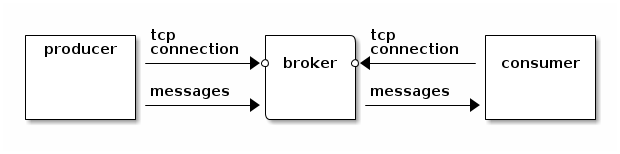
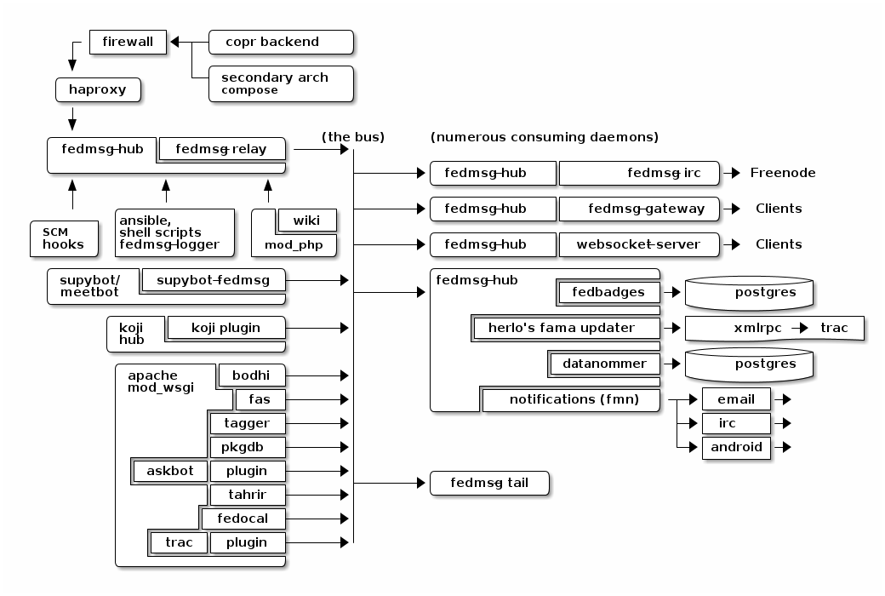
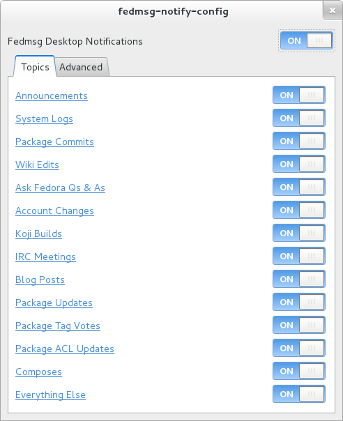
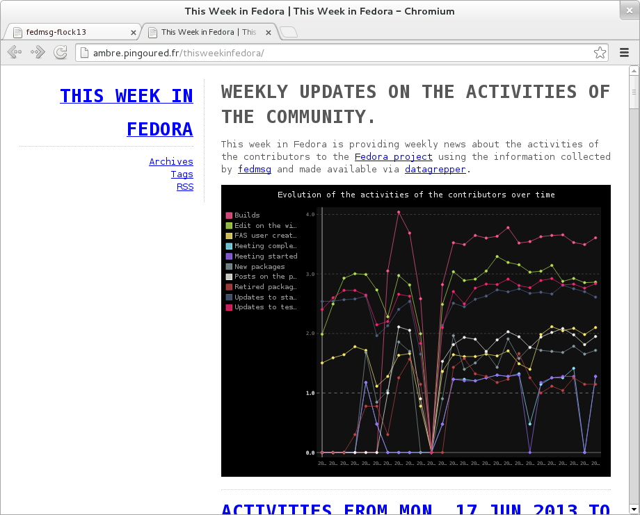

:title: fedmsg-devconf14
:css: css/style-fedmsg.css
:data-transition-duration: 500
:skip-help: true
:hovercraft-path: m275,175 v-150 a150,150 0 0,0 -150,150 z

----

fedmsg
======
The Fedora Infrastructure Message Bus
~~~~~~~~~~~~~~~~~~~~~~~~~~~~~~~~~~~~~

DevConf14, Brno, Czech Republic, February 9th, 2014

- Presented by Ralph Bean
- http://github.com/ralphbean
- http://twitter.com/ralphbean
- http://threebean.org
- ``2048R/971095FF 2012-12-06``

Go sit in ``#fedora-fedmsg`` on ``irc.freenode.net``.

- Slides: http://threebean.org/presentations/fedmsg-devconf14/

- Feedback: http://devconf.cz/f/56

.. image:: images/fedmsg-devconf14-img/creative-commons.png

----

fedmsg
======
what it is
~~~~~~~~~~

----

:data-x: r0
:data-y: r900

The `Fedora Infrastructure Message Bus <http://fedmsg.com>`_ is a
python package and API used around Fedora Infrastructure to send
and receive messages to and from applications.  The core lib is
stable.

It's not my idea!  In 2009, `jkeating started making noise about
a message bus
<http://jkeating.fedorapeople.org/lfnw-messaging-2009.pdf>`_ and
how cool it would be.

We wanted to hook all the services in Fedora Infrastructure up to
send messages to one another over a message bus instead of
communicating with each other in the heterogeneous,
“Rube-Goldberg” ways they do now.

----

It has had Fedora in the name, but `Debian Infrastructure picked it up
<http://lists.debian.org/debian-qa/2013/04/msg00010.html>`_
this past summer with `success
<http://blog.olasd.eu/2013/07/bootstrapping-fedmsg-for-debian/>`_.  We've
now changed the name to mean the *FEDerated Message Bus* instead.  See the
`fosdem talk <https://fosdem.org/2014/schedule/event/fedmsg/>`_ for more on
that relationship.

----

:data-x: r1600
:data-y: 0
:data-scale: 1

It's meant to be deployed in an open infrastructure.  Anyone can read.
Anyone can write.  Only some messages are trusted.

We (Fedora Infrastructure) use *X.509 certificates* to **sign** messages;
fedmsg can also handle *gpg* signatures (Debian will be doing this).

----

:data-x: r1600
:data-y: r0

fedmsg is built on top of `ØMQ <http://zeromq.org>`_.

There is no central broker and as far as we can tell, no single
point of failure.

----

:data-x: r0
:data-y: r900

In most centralized models, if a service or script wants to publish a message,
it must first connect to a broker.

With fedmsg, the onus of initiation is inverted.

**Advantage**:  If the consuming service (or broker) is down or unreachable,
the producer isn't stuck.

----

:data-x: r0
:data-y: r900

----

With no centralized broker to distribute information, we needed a way to:

- Tell producers which port(s) to bind to.
- Tell consumers which IP/port(s) to connect to.

These are called 'endpoints'.

fedmsg can do this in one of two ways:

- It can read in the list of endpoints from a config file in
  ``/etc/fedmsg.d/`` -- Fedora Infrastructure does it this way.
- Query a dns ``SRV`` record for the list of endpoints.  Debian Infrastructure
  plans to do it this way.

----

Theoretically, there could be dropped messages.

**However**, we wrote a script that hourly compared the list of koji builds
with the list of fedmsg messages about koji builds to see if there were
any discrepancies.  *None were found.*

**Furthermore**, fedmsg has the option to turn on a local message store
and replay mechanism for producers, but we have no reports of anyone
using it in production.  It requires that each local sender *have its own
database* to store every message sent.  It significantly increases the
overheard of deploying fedmsg.

*(With the risk of dropped messages comes increased flexibility.)*

----

:data-x: r1600
:data-y: 0

The bus is **publicly subscribable**

Hit up ``tcp://hub.fedoraproject.org:9940`` with a ``zmq.SUB`` socket.
This is configured by default when you ``yum install fedmsg``.

.. code:: python

    # This is installed by default...
    "fedora-infrastructure": [
        "tcp://hub.fedoraproject.org:9940",
        #"tcp://stg.fedoraproject.org:9940",
    ],

To listen to debian messages on your box, add this to
``/etc/fedmsg.d/endpoints.py``:

.. code:: python

    # You can get messages from here too!
    "debian-infrastructure": [
        "tcp://fedmsg.olasd.eu:9940",
    ],

----

:data-x: r1600
:data-y: 0
:data-scale: 1

topics
======
what messages?
~~~~~~~~~~~~~~

----

:data-x: r0
:data-y: r900

topics
======

Full list at http://fedmsg.com/en/latest/topics/, including:

- askbot.post.edit
- bodhi.update.comment
- bodhi.update.request.testing
- buildsys.build.state.change
- copr.build.end
- fas.group.member.sponsor
- fas.role.update
- fedocal.meeting.update
- git.receive
- meetbot.meeting.start
- pkgdb.acl.update
- planet.post.new
- wiki.article.edit

----

:data-x: r0
:data-y: r900

topics
======
visualization
~~~~~~~~~~~~~

There is a `script <https://github.com/ralphbean/fedmsg2gource>`_ to generate
visualizations of the bus 

Let's check it out!

----

:data-x: r1600
:data-y: 0

fedmsg
======
how to do it
~~~~~~~~~~~~

----

:data-x: r0
:data-y: r900

first
=====
you have to get it
~~~~~~~~~~~~~~~~~~

.. code:: bash

    $ sudo yum install fedmsg

----

sending messages
================
from the shell
~~~~~~~~~~~~~~

.. code:: bash

    $ echo "Hello World." | fedmsg-logger --modname=git --topic=repo.update

    $ echo '{"a": 1}' | fedmsg-logger --json-input

    $ fedmsg-logger --message="This is a message."

    $ fedmsg-logger --message='{"a": 1}' --json-input

----

sending messages
================
from python
~~~~~~~~~~~

.. code:: python

    import fedmsg

    fedmsg.publish(
        topic='testing',
        msg={
            'test': 'Hello World',
            'foo': jsonifiable_objects,
            'bar': a_sqlalchemy_object,
        }
    )

----

:data-x: r1600
:data-y: 900

consuming messages
==================
at the command line
~~~~~~~~~~~~~~~~~~~

.. code:: bash

    $ fedmsg-tail --really-pretty

.. code:: python

    {
        "i": 1,
        "timestamp": 1344344053.2337201,
        "topic": "org.fedoraproject.prod.bodhi.update.comment",
        "msg": {
            "comment": {
                "update_title": "nethack4-4.0.0-1.fc20",
                "group": None,
                "author": "ralph",
                "text": "I'm so pumped to pwn those minotaurs!",
                "karma": 1,
                "anonymous": False,
                "timestamp": 1344344050.0
            }
        }
    }

----

:data-x: r0
:data-y: r900

consuming messages
==================
from python
~~~~~~~~~~~

.. code:: python

    import fedmsg

    for name, endpoint, topic, msg in fedmsg.tail_messages():
        print topic, msg

----

:data-x: r0
:data-y: r900

consuming messages
==================
with a daemon
~~~~~~~~~~~~~

``fedmsg-hub`` is a daemon that can make writing your own
long-running consumers simpler.  There are `docs on fedmsg.com
<http://www.fedmsg.com/en/latest/consuming/#the-hub-consumer-approach>`_
for writing plugins, but they look like this:

.. code:: python

    import pprint
    import fedmsg.consumers

    class MyConsumer(fedmsg.consumers.FedmsgConsumer):
        topic = "org.fedoraproject.*"
        config_key = 'myconsumer.enabled'

        def consume(self, message):
            pprint.pprint(message)

lmacken wrote `an example consumer
<https://github.com/lmacken/fedmsg-koji-consumer>`_ with everything you need.
Clone it and use it as a starting point as you please.

----

:data-x: r0
:data-y: r900
:data-scale: 0.5

consuming messages
==================
at the command line... an aside
~~~~~~~~~~~~~~~~~~~~~~~~~~~~~~~

There are lots of fun options to ``fedmsg-tail``.

*(Aside: there is a plugin system to provide domain-specific metadata about
messages.  Debian is working on their own.  Install the Fedora one!)*

.. code:: bash

   $ sudo yum install python-fedmsg-meta-fedora-infrastructure

With that, you can use the more fantastic options:

.. code:: bash

   $ fedmsg-tail --terse

.. code:: text

    buildsys.build.state.change -- ausil's tncfhh-0.8.3-14.fc20 completed
    http://koji.fedoraproject.org/koji/buildinfo?buildID=439734
    trac.ticket.update -- kevin closed a ticket on the Fedora Infrastructure trac instance as 'fixed'
    https://fedorahosted.org/fedora-infrastructure/ticket/3904
    bodhi.update.request.testing -- mmckinst submitted nawk-20121220-1.fc18 to testing
    https://admin.fedoraproject.org/updates/nawk-20121220-1.fc18
    wiki.article.edit -- Hguemar made a wiki edit to "Flock:Rideshare"
    https://fedoraproject.org/w/index.php?title=Flock:Rideshare&diff=prev&oldid=347430

----

:data-x: r1600
:data-y: 0

things that use fedmsg
======================
there's a lot of them at this point
~~~~~~~~~~~~~~~~~~~~~~~~~~~~~~~~~~~

----

:data-x: r0
:data-y: r900

koji
====
stalk
~~~~~

David Aquilina's (dwa's) `koji stalk
<http://dwa.fedorapeople.org/wip/koji-stalk.py>`_ monitors koji over fedmsg and
rebuilds packages for arm and ppc.

----

FAS2Trac (ftl)
==============
(fama updater)
~~~~~~~~~~~~~~

herlo's `FAS2Trac fama updater (ftl)
<https://git.fedorahosted.org/cgit/ftl.git>`_ listens to messages indicating
that a user has applied for membership in the ambassadors group -- it then
files a ticket in the `ambassadors' trac instance
<https://fedorahosted.org/fama/>`_ for a potential sponsor via XMLRPC.

----

compose
=======
downloader
~~~~~~~~~~

p3ck's `fedmsg-download <https://github.com/p3ck/fedmsg-download/>`_
listens for messages that the daily branched and rawhide compose
process has finished -- it then downloads the latest builds from
``rsync://dl.fedoraproject.org/fedora-linux-development``

----

notifications
=============
on the desktop
~~~~~~~~~~~~~~

lmacken's `fedmsg-notify <http://lewk.org/blog/fedmsg-notify>`_ listens
for messages and displays a filtered stream on your desktop with ``libnotify``.

.. image:: images/fedmsg-devconf14-img/fedmsg-notify-0-crop.png
   :height: 300px

----

notifications
=============
on the desktop
~~~~~~~~~~~~~~

For kicks, there's a gnome-shell extension.

.. image:: images/fedmsg-devconf14-img/gnome-shell-extension-fedmsg.png
   :height: 300px

----

notifications
=============
on the desktop
~~~~~~~~~~~~~~

You can turn on and off all kinds of message types.

----

notifications
=============
on the desktop
~~~~~~~~~~~~~~

Some more advanced message filtration.

.. image:: images/fedmsg-devconf14-img/fedmsg-notify-config-1.png
   :height: 500px

----

nom
===
all the data
~~~~~~~~~~~~

`datanommer <https://github.com/fedora-infra/datanommer>`_ was
originally `conceived of by Ian Weller
<https://fedoraproject.org/wiki/User:Ianweller/statistics_plus_plus>`_.
It's a fedmsg-hub plugin that sits listening on the bus and
simply throws every message into a database.

It has a partner: `datagrepper
<https://apps.fedoraproject.org/datagrepper>`_!  Datagrepper is
an HTTP JSON API for the whole history of messages kept in datanommer.

Datagrepper is **really cool**.  The quite easy to use.

----

reports
=======
10 ways from sunday
~~~~~~~~~~~~~~~~~~~

`pingou <http://blog.pingoured.fr/>`_ has been really busy writing tools
against `datagrepper <https://apps.fedoraproject.org/datagrepper>`_...

----

reports
=======
10 ways from sunday
~~~~~~~~~~~~~~~~~~~

pingou's `fedora-news <http://ambre.pingoured.fr/fedora-news/>`_ is a
nice HTML5 mobile-ready app that gives you access to all sorts of the
latest information from the Fedora Community.

.. image:: images/fedmsg-devconf14-img/fedora-news-screencast.gif
   :height: 420px

----

reports
=======
10 ways from sunday
~~~~~~~~~~~~~~~~~~~

pingou's `this-week-in-fedora <http://ambre.pingoured.fr/thisweekinfedora/>`_
weekly posts stats about the most active contributors.

----

reports
=======
10 ways from sunday
~~~~~~~~~~~~~~~~~~~

Every week, pingou's `owner changes report tool
<https://lists.fedoraproject.org/pipermail/infrastructure/2013-June/013070.html>`_
emails the devel list with a report of what packages were orphaned, unorphaned
and retired.

.. image:: images/fedmsg-devconf14-img/ownerchange-screenshot.png
   :height: 420px

----

fedora badges
=============
for you, and you, and you
~~~~~~~~~~~~~~~~~~~~~~~~~

`Fedora badges <https://badges.fedoraproject.org/>`_ is driven by fedmsg.

.. image:: images/fedmsg-devconf14-img/badges_fan.png

The badge awarding backend daemon, `fedbadges
<https://github.com/fedora-infra/fedbadges>`_, wakes up when it receives a
fedmsg event. It compares that message and the history in datanommer against a
series of `rules <https://git.fedorahosted.org/cgit/badges.git>`_. If a
contributor matches the criteria described in one of those rules, then they are
**awarded a badge** in real time.

----

notifications
=============
to your inbox, irc, ...
~~~~~~~~~~~~~~~~~~~~~~~

**fedmsg-notifications.** -- *Problem:* all of our
applications carry their own email code.  With that comes further baggage
and maintenance.

With fedmsg notifications for interesting infrastructure events, we can
put all that code in one place where it can be more easily maintained.

Benefit to the end-user:  manage notification preferences in one place
instead of per-app.

What about notifications to different *contexts*?  Email?
IRC privmsg?  Android?  RSS?

We just soft launched a beta of this last week.  Please try it out
and file bugs, RFEs, etc:  `https://apps.fedoraproject.org/notifications
<https://apps.fedoraproject.org/notifications>`_.

----

:data-x: r1600
:data-y: 0

future
======
stuff
~~~~~

----

:data-x: r0
:data-y: r900

future
======
stuff
~~~~~

**Bugzilla Messages!**

*(coming in Spring of 2014)*

----

:data-x: r0
:data-y: r900

future
======
stuff
~~~~~

**Fedora Mobile** -- See Ricky Elrod's `landing page
<http://fedoramobile.elrod.me/>`_.

----

:data-x: r0
:data-y: r900

future
======
stuff
~~~~~

**Mirror pushing.** -- *Problem:* We have over 200 mirrors that help serve
Fedora releases.  You can read more about them `here
<https://fedoraproject.org/wiki/Infrastructure/Mirroring>`_.
As it stands they all run ``rsync`` on some interval to poll for new content.

There was some discussion of pushing the data years ago, but mirror admins are
understandably reluctant to allow someone access to push content onto their
machines.  With a fedmsg solution, we would only push a notification; the
pulling is still within the admin's control.

There was a `pull request <https://github.com/fedora-infra/fedmsg/pull/158>`_
that added a ``fedmsg-trigger`` command to fedmsg core.  We can use that to
kick off rsync jobs when messages matching certain criteria are received.

Now, though, we are waiting on bodhi2 to be released.  We need messages from
the ``masher`` process about when updates are finally pushed.  bodhi1's masher
had `some problems <https://github.com/fedora-infra/fedmsg/issues/115>`_ with
fedmsg.

----

:data-x: r0
:data-y: r900

future
======
stuff
~~~~~

**taskotron** -- The QA-devel team is using the downtime before the Fedora 21
development cycle to build `taskotron
<https://fedoraproject.org/wiki/User:Tflink/taskotron_contribution_guide>`_ to
scale the manpower of infra/qa/releng.  It will kick of automated QA tasks in
response to all the various pieces of the development and update process.

----

:data-x: r0
:data-y: r900

future
======
stuff
~~~~~

**cnucnuweb** -- Pierre has been working on something we cooked up in concept
at Flock 2013:  a webapp replacement for the `wiki page used for upstream
release monitoring
<https://fedoraproject.org/wiki/Upstream_release_monitoring>`_.

With it, we can send messages that might be useful to Linux distributions *in
general*.  It is called `cnucnuweb
<https://github.com/fedora-infra/cnucnuweb/>`_.

----

:data-x: r1600
:data-y: r0

get on the bus!
===============

Get the source:

- http://fedmsg.com
- http://github.com/fedora-infra/fedmsg

Presented by:

- Presented by Ralph Bean
- http://github.com/ralphbean
- http://twitter.com/ralphbean
- http://threebean.org
- ``2048R/971095FF 2012-12-06``
- Slides: http://threebean.org/presentations/fedmsg-devconf14/
- Feedback: http://devconf.cz/f/56

Development discussed in ``#fedora-apps``.

Join ``#fedora-fedmsg`` for the firehose.

.. image:: images/fedmsg-devconf14-img/creative-commons.png
