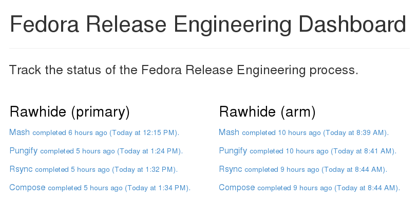

:title: fedmsg-flock14
:css: css/style-fedmsg.css
:data-transition-duration: 500
:skip-help: true
:hovercraft-path: m275,175 v-150 a150,150 0 0,0 -150,150 z

----

fedmsg
======
The Fedora Infrastructure Message Bus
~~~~~~~~~~~~~~~~~~~~~~~~~~~~~~~~~~~~~

FLOCK14, Prague CZ, August 8th, 2014

- Presented by Ralph Bean
- http://github.com/ralphbean
- http://twitter.com/ralphbean
- http://threebean.org
- ``2048R/971095FF 2012-12-06``

Go sit in ``#fedora-fedmsg`` on ``irc.freenode.net``.

http://threebean.org/presentations/fedmsg-flock14/

.. image:: images/fedmsg-flock14-img/creative-commons.png

----

fedmsg
======
what it is
~~~~~~~~~~

----

:data-x: r0
:data-y: r900

The `Fedora Infrastructure Message Bus <http://fedmsg.com>`_ is a
python package and API used around Fedora Infrastructure to send
and receive messages to and from applications.

It's not my idea!  In 2009, `jkeating started making noise about
a message bus
<http://jkeating.fedorapeople.org/lfnw-messaging-2009.pdf>`_ and
how cool it would be.

We wanted to hook all the services in Fedora Infrastructure up to
send messages to one another over a message bus instead of
communicating with each other in the heterogeneous,
“Rube-Goldberg” ways they did previously.

----

:data-x: r0
:data-y: r900

.. image:: images/fedmsg-flock14-img/topology.png
   :height: 485px

----

:data-x: r1600
:data-y: 0

It is *publicly subscribable* -- hit up ``tcp://hub.fedoraproject.org:9940``
with a ``zmq.SUB`` socket.

It has Fedora in the name, but `Debian Infrastructure started picking it up
<http://lists.debian.org/debian-qa/2013/04/msg00010.html>`_
last summer.  They've `made progress
<http://blog.olasd.eu/2013/07/bootstrapping-fedmsg-for-debian/>`_ to the point
that we had to change the name to mean the *FEDerated Message Bus* instead.

`data.gouv.fr <https://data.gouv.fr>`_ is using it too.  Maybe others?  We get
questions and clarifications on the `deployment docs
<http://fedmsg.com/en/latest/deployment>`_ from time to time.

----

:data-x: r1600
:data-y: 0

fedmsg
======
what do?
~~~~~~~~

There are two aspects to this workshop:

- **A historical component**.  I want to show you briefly how to use
  `datagrepper <https://apps.fedoraproject.org/datagrepper>`_ which has been
  the most surprisingly useful piece of the fedmsg infrastructure.

- **A realtime component**.  I want to go over some of the current applications
  of fedmsg briefly.  After that, I'll go into depth -- step-by-step -- to show
  you how to write your own script that connects to the live fedmsg stream and
  does something "useful" with it.

Do you want me to cover?

- **Setting up your own local bus**.  It's really pretty easy and we can do it
  in time.  I'm just guessing that nobody here is interested in doing that.
  I'll touch on it but we can talk more about it later if you like.

----

:data-x: r0
:data-y: r900

first
=====
you should get it
~~~~~~~~~~~~~~~~~

.. code:: bash

    $ sudo yum install fedmsg

There's also a plugin that let's us render **Fedora Infrastructure** messages
nicely.  You should install that too:

.. code:: bash

    $ sudo yum install python-fedmsg-meta-fedora-infrastructure

----

:data-x: r1600
:data-y: 0

A taste
=======
of the bus
~~~~~~~~~~

Clone the repo from https://github.com/ralphbean/fedmsg2gource

Run::

    $ python fedmsg2gource.py --days 14 > testing.log
    $ cat testing.log | \
        gource -i 10 \
            --user-image-dir ~/.cache/avatars/ \
            --log-format custom \
            --viewport 1024x730 \
            -

----

:data-x: r0
:data-y: r900

Explore
=======
the datagrepper API
~~~~~~~~~~~~~~~~~~~

----

:data-x: r1600
:data-y: 0

say
===
you wanted your own local bus
~~~~~~~~~~~~~~~~~~~~~~~~~~~~~

.. code:: bash

    $ sudo yum install fedmsg-relay
    $ sudo systemctl start fedmsg-relay
    $ echo "Hello World." | fedmsg-logger --modname=git --topic=repo.update
    $ echo '{"a": 1}' | fedmsg-logger --json-input
    $ fedmsg-logger --message="This is a message."
    $ fedmsg-logger --message='{"a": 1}' --json-input

or from python:

.. code:: python

    import fedmsg

    fedmsg.publish(
        topic='testing',
        msg={
            'test': 'Hello World',
            'foo': jsonifiable_objects,
            'bar': a_sqlalchemy_object,
        }
    )

----

:data-x: r1600
:data-y: 900

if
==
you want to consume
~~~~~~~~~~~~~~~~~~~

.. code:: bash

    $ fedmsg-tail --really-pretty

.. code:: python

    {
        "i": 1,
        "timestamp": 1344344053.2337201,
        "topic": "org.fedoraproject.prod.bodhi.update.comment",
        "msg": {
            "comment": {
                "update_title": "nethack4-4.0.0-1.fc20",
                "group": None,
                "author": "ralph",
                "text": "I'm so pumped to pwn those minotaurs!",
                "karma": 1,
                "anonymous": False,
                "timestamp": 1344344050.0
            }
        }
    }

----

:data-x: r0
:data-y: r900

consuming messages
==================
from python
~~~~~~~~~~~

.. code:: python

    import fedmsg

    for name, endpoint, topic, msg in fedmsg.tail_messages():
        print topic, msg

----

:data-x: r0
:data-y: r900

consuming messages
==================
with a daemon
~~~~~~~~~~~~~

``fedmsg-hub`` is a daemon that can make writing your own
long-running consumers simpler.  There are `docs on fedmsg.com
<http://www.fedmsg.com/en/latest/consuming/#the-hub-consumer-approach>`_
for writing plugins, but they look like this:

.. code:: python

    import pprint
    import fedmsg.consumers

    class MyConsumer(fedmsg.consumers.FedmsgConsumer):
        topic = "org.fedoraproject.*"
        config_key = 'myconsumer.enabled'

        def consume(self, message):
            pprint.pprint(message)

----

:data-x: r0
:data-y: r900
:data-scale: 0.5

consuming messages
==================
at the command line... an aside
~~~~~~~~~~~~~~~~~~~~~~~~~~~~~~~

There are lots of fun options to ``fedmsg-tail`` like ``--terse``.

.. code:: bash

   $ fedmsg-tail --terse

.. code:: text

    buildsys.build.state.change -- ausil's tncfhh-0.8.3-14.fc20 completed
    http://koji.fedoraproject.org/koji/buildinfo?buildID=439734
    trac.ticket.update -- kevin closed a ticket on the Fedora Infrastructure trac instance as 'fixed'
    https://fedorahosted.org/fedora-infrastructure/ticket/3904
    bodhi.update.request.testing -- mmckinst submitted nawk-20121220-1.fc18 to testing
    https://admin.fedoraproject.org/updates/nawk-20121220-1.fc18
    wiki.article.edit -- Hguemar made a wiki edit to "Flock:Rideshare"
    https://fedoraproject.org/w/index.php?title=Flock:Rideshare&diff=prev&oldid=347430

----

:data-x: r1600
:data-y: 0

things that use fedmsg
======================
there's a lot of them at this point
~~~~~~~~~~~~~~~~~~~~~~~~~~~~~~~~~~~

----

:data-x: r0
:data-y: r900

koji
====
stalk
~~~~~

David Aquilina's (dwa's) `koji stalk
<http://dwa.fedorapeople.org/wip/koji-stalk.py>`_ monitors koji over fedmsg and
rebuilds packages for arm and ppc.

----

FAS2Trac (ftl)
==============
(fama updater)
~~~~~~~~~~~~~~

herlo's `FAS2Trac fama updater (ftl)
<https://git.fedorahosted.org/cgit/ftl.git>`_ listens to messages indicating
that a user has applied for membership in the ambassadors group -- it then
files a ticket in the `ambassadors' trac instance
<https://fedorahosted.org/fama/>`_ for a potential sponsor via XMLRPC.

----

compose
=======
downloader
~~~~~~~~~~

p3ck's `fedmsg-download <https://github.com/p3ck/fedmsg-download/>`_
listens for messages that the daily branched and rawhide compose
process has finished -- it then downloads the latest builds from
``rsync://dl.fedoraproject.org/fedora-linux-development``

----

synchronization
===============
of package ACLs
~~~~~~~~~~~~~~~

So, it **used** to be that when someone was granted *commit* access to a
package in the `Fedora PackageDB (pkgdb)
<https://apps.fedoraproject.org/#PkgDB>`_, the webapp simply wrote to a
database table indicating the new relationship.  Every *hour*, a cronjob would
run that queried the state of that database and then re-wrote out the ACLs for
gitolite -- the software that manages access to our `package repositories
<http://pkgs.fedoraproject.org>`_.

Consequently, we had lots of *waiting*: you would request commit access to a
repository, then *wait* for an owner to grant you rights, then *wait* for that
cronjob to run before you could actually push.

With `a new fedmsg consumer
<https://github.com/fedora-infra/fedmsg-genacls/blob/develop/fedmsg_genacls.py>`_
that we have in place, those gitolite ACLs are re-written in response to
fedmsg messages from the pkgdb.  It is much faster.

----

notifications
=============
to email, irc, the desktop, and android
~~~~~~~~~~~~~~~~~~~~~~~~~~~~~~~~~~~~~~~

There's the new `FMN system <https://apps.fedoraproject.org/>`_ that can
deliver notifications to you via irc, email, and android.

There's also lmacken's `fedmsg-notify <http://lewk.org/blog/fedmsg-notify>`_
which listens for messages and displays a filtered stream on your desktop with
``libnotify``.

.. image:: images/fedmsg-flock14-img/fedmsg-notify-0-crop.png
   :height: 300px

----

reports
=======
10 ways from sunday
~~~~~~~~~~~~~~~~~~~

Every week, pingou's `owner changes report tool
<https://lists.fedoraproject.org/pipermail/infrastructure/2013-June/013070.html>`_
emails the devel list with a report of what packages were orphaned, unorphaned
and retired.

.. image:: images/fedmsg-flock14-img/ownerchange-screenshot.png
   :height: 420px

----

reports
=======
10 ways from sunday
~~~~~~~~~~~~~~~~~~~

There's also the `Release Engineering Dashboard
<https://apps.fedoraproject.org/releng-dash>`_ which grabs data from
datagrepper on all the latest updates syncs, composes, image builds, etc.. and
puts their status all in one place.  Pure HTML/javascript -- there's no
server-side app here.

TODO -- screenshot needed.

----

fedora badges
=============
for you, and you, and you
~~~~~~~~~~~~~~~~~~~~~~~~~

`Fedora badges <https://badges.fedoraproject.org/>`_ launched last year at
Flock13.  It awards "badges" to Fedora contributors for their activity.

.. image:: images/fedmsg-flock14-img/badges_fan.png

Pretty fun.  ``:)``

----

To sum that up
==============

The assimilation of **message producing services** is nearly complete.

There are many **message consuming services** already in place.. but we can
likely make many more.  Which is why you're here, no?

----

:data-x: r1600
:data-y: 0

Today's
=======
task
~~~~

Surprise!  We're going to make a Twitter Bot!

----

:data-x: r0
:data-y: r900

How
===
it's going to work
~~~~~~~~~~~~~~~~~~

TODO - make a diagram of how the program will work

----

Take this
=========
It's dangerous out there
~~~~~~~~~~~~~~~~~~~~~~~~

.. code:: bash

    $ sudo yum install fedmsg
    $ sudo yum install python-fedmsg-meta-fedora-infrastructure
    $ sudo yum install python-fabulous
    $ sudo yum install tweepy

----

Your first
==========
fedmsg script
~~~~~~~~~~~~~

.. code:: python

    import fedmsg

    print "Posting up to listen on the fedmsg bus.  Waiting for a message..."
    for name, endpoint, topic, msg in fedmsg.tail_messages():
        print msg

Give it a run.

----

It's like a million voices cried out at once
============================================
and then were silent
~~~~~~~~~~~~~~~~~~~~

.. code:: python

    #topic_filter = 'fedbadges'     # We really want this, but its rare
    topic_filter = 'fedoratagger'   # This is much easier to test with

    for name, endpoint, topic, msg in fedmsg.tail_messages():
        if topic_filter not in topic:
            # Bail out if the topic doesn't match
            continue

        print msg

----

Some config
===========
at the top
~~~~~~~~~~

.. code:: python

    import fedmsg.config
    import logging.config

    # First, load the fedmsg config from fedmsg.d/
    config = fedmsg.config.load_config()

    # Then, configure the python stdlib logging to use fedmsg's logging config
    logging.config.dictConfig(config.get('logging'))

----

So
==
meta
~~~~

.. code:: python

    import fedmsg.meta

    # Initialize fedmsg's "meta" module if you have the fedora infra plugin
    fedmsg.meta.make_processors(**config)

    for name, endpoint, topic, msg in fedmsg.tail_messages():
        if topic_filter not in topic:
            continue

        # Use it to make nice text and other things
        # See also: msg2icon, msg2link, msg2usernames, msg2packages...
        subtitle = fedmsg.meta.msg2subtitle(msg, **config)
        print subtitle

----

A picture
=========
is worth a thousand words
~~~~~~~~~~~~~~~~~~~~~~~~~

.. code:: python

    import fabulous
    import tempfile
    import urllib

    for name, endpoint, topic, msg in fedmsg.tail_messages():
        # This returns a URL (most of the time)
        icon = fedmsg.meta.msg2icon(msg, **config)

        _, filename = tempfile.mkstemp(suffix='.png')
        print "Downloading", icon, "to", filename
        urllib.urlretrieve(icon, filename)

        print fabulous.image.Image(filename)

        print "Cleaning up %r" % filename
        os.remove(filename)

----

:data-x: r1600
:data-y: 0

Intermezzo
==========

We have a neat working script that gets fedmsg messages pushed to it.  It can
extract neato stuff and print it.

But... if we want to move to the next step, we have to take a break from our
happy hacking to go and deal with Twitter, its API, and API keys.

----

The Twitter API
===============

twitter credentials
twitter api
systemd
