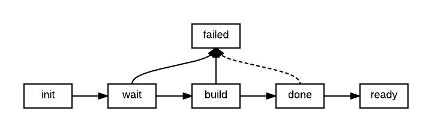
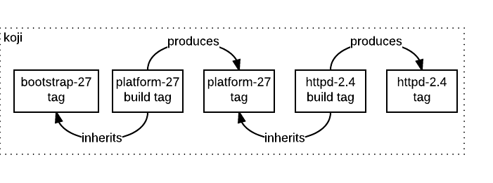
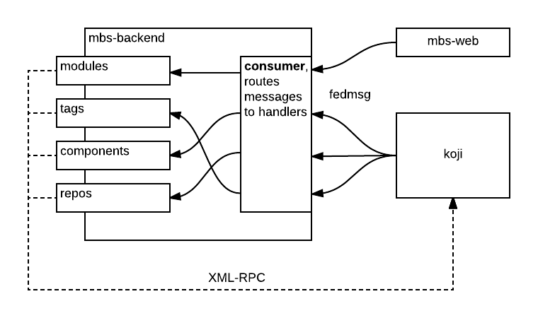

:title: mbs-flock17
:css: css/style-fedora.css
:data-transition-duration: 700
:skip-help: true
:hovercraft-path: m275,175 v-150 a150,150 0 0,0 -150,150 z
 
----

The module-build-service
========================
and so can you!
~~~~~~~~~~~~~~~

Presented at `Flock 2017 <https://fedoraproject.org/wiki/Flock_2017>`_ by `@ralphbean <http://threebean.org>`_.

Slides available at http://threebean.org/presentations/mbs-flock17/

.. image:: images/fedmsg-flock14-img/creative-commons.png

----

Today
=====
in 15 minutes
~~~~~~~~~~~~~

- The history of thinking on “how to build modules”. What has changed in the last year?
- A review of MBS internals. How does it work today? You can help make it better!
- What missing features we would like to see implemented in the coming year.

----

:data-x: r1600
:data-y: 0

History of
==========
"how to build modules"
~~~~~~~~~~~~~~~~~~~~~~

We presented last year at Flock with a **barely working** prototype.

Since then, nothing has fundamentally changed with respect to the build process.  Here are some highlights:

- We were building in a **dev** mbs instance in **staging** koji.  The MBS went into production in February 2017.
- We had a near **total rewrite** of pungi needed to compose these into usable pieces.  This is much simpler now.
- We grew local **mock** and **copr** backends.
- Modules no longer create long-lived targets in koji which was a source of concern in the Spring.
- We grew the ability to throttle builds in koji and to **tier** component builds into batches.
- We grew the ability to re-use **some** components from previous module builds.

Let's look at these last two in more detail.

----

:data-x: r0
:data-y: r900

Build order
===========
groups
~~~~~~

We used to submit a single component build to koji, and then wait for the repo
regen to **include that build in the buildroot** of the next build.  Only after
waiting for kojira, would we submit the next build.  This was **insanely slow**.

Our approach now takes a **hint** from the modulemd format.  Components may be
grouped into **build order groups**.

All of the components in a single build order group will be built in parallel,
without waiting for repo regeneration.  Once they're all done, we regenerate
the repo and start on the next group.

----

Re-using
========
components
~~~~~~~~~~

The original theory was that we can't re-use builds, because the buildroot
**might** have changed.

Our currently implemented approach leverages the build order groups.  There's
more to it, but in short:

- If **none of the spec files have changed** in a build order group or any of its
  predecessors, then re-use the whole group.
- If **one or more of the spec files have changed in a group**, then rebuild those
  components but re-use all others in the group.
- If **any components were rebuilt in preceding groups**, then (unfortunately) we
  have to rebuild all components in the current group.

This lets us only rebuild components if there **might be** significant changes in
their build environment.

----

:data-x: r1600
:data-y: 0

A review
========
of MBS internals
~~~~~~~~~~~~~~~~

Primarilly composed of two processes:

- A **web frontend**
- A fedmsg-driven **backend** called "the scheduler"

----

:data-x: r0
:data-y: r900

The web
=======
frontend
~~~~~~~~

The web frontend responds to queries about the status of modules.
it also receives requests to build new modules.

Upon receipt of a request to build, the frontend:

- **records** the build.
- **checks dist-git** to ensure the refs are valid.
- **records details** of the refs at the time of build
- **publishes** a fedmsg about the new request.

The backend then picks up the messages about the new request and, if it is idle, it starts processing it.

----

module build
============
states
~~~~~~

Module builds move through a series of states as they are built:

- They are initially in the ``wait`` state when the build is received but not yet validated.
- After being validated the module moves to the ``init`` state.
- Once the backend picks it up it moves to the ``build`` state.
- A number of things happen here.  Once the last rpm is built, it moves to the ``done`` state.
- The build then immediately moves to a final state called ``ready``.

All the work happens in the ``build`` state.

----

Build steps
===========
in koji
~~~~~~~

First, let's distinguish between the different Builder backends.  We currently
have code to build in local mock, in a remote koji instance, or in a remote
copr instance.

(1.0) build tags are created for the module (build and dist).

(1.1) Importantly, the build tag inherits from other modules that the module declares build-time deps on.

(1.2) Furthermore, the ``build`` and ``srpm-build`` groups are defined based on **profiles** of those dependencies.

(2.0) Then, a ``module-build-macros`` srpm is synthesized and built.

(3.0) Finally, the rpms in the module are built in a series of "buildorder groups" (remember from earlier?).

----

How is this
===========
organized?
~~~~~~~~~~

----

A word
======
about local builds
~~~~~~~~~~~~~~~~~~

You can build modules locally with the ``mbs-build local`` command.

That process **is** an instance of the mbs backend schedular (with the local mock
builder plugin enabled).  The same process running in the production
environment.

----

:data-x: r1600
:data-y: 0

Missing features
================

Things we're working on in the near future.

- Build-time filtering
- Transitive deps
- Smarter component re-use.
- The ``context`` value.
- Stream expansion

----

:data-x: r1600
:data-y: 0

Thank you
=========

The `module-build-service` is written by: Jan Kaluza, Ralph Bean, Filip
Valder, Jakub Kadlčík, Matt Prahl, Lubos Kocman, Petr Šabata, Nils Philippsen,
Karsten Hopp, Stanislav Ochotnicky, Tomas Tomecek, Neha Prasad, Courtney
Pacheco, Owen W. Taylor, Matt Jia, Yashvardhan Nanavati, Patrick Uiterwijk, and
James Antill.

`@asamalik <https://github.com/asamalik>`_ will pick it up next on "Packaging Modularity".

Slides available at http://threebean.org/presentations/mbs-flock17/

.. image:: images/fedmsg-flock14-img/creative-commons.png
