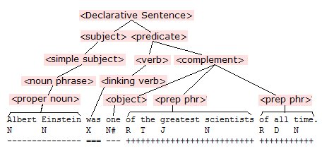
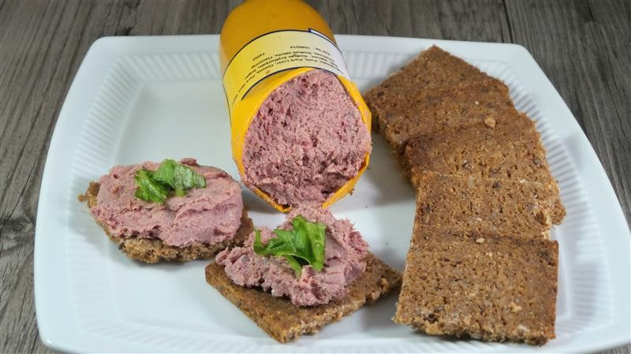
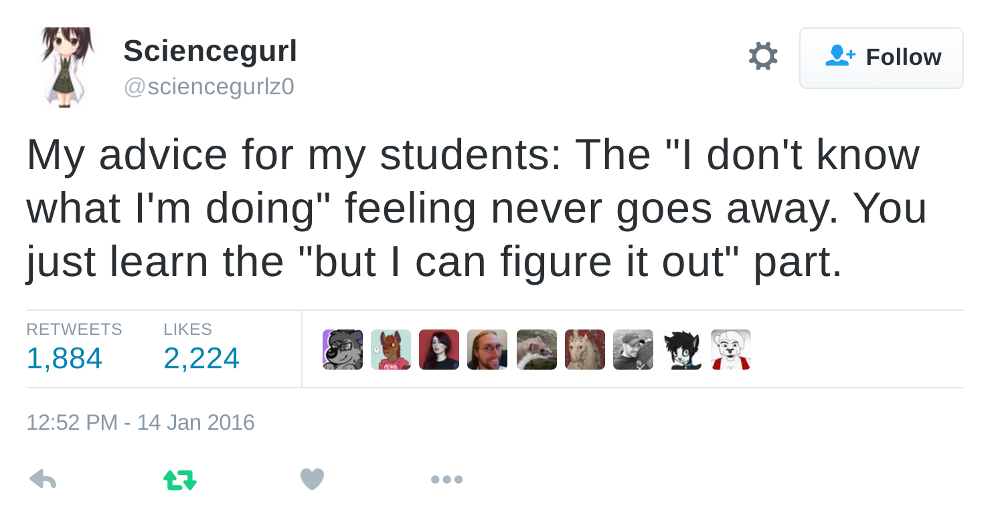
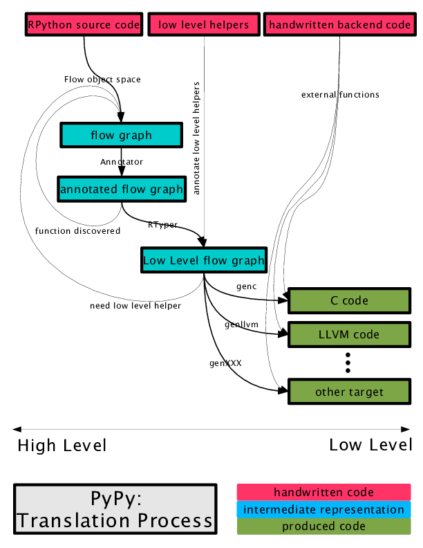
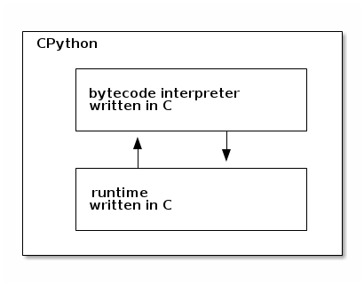

:title: pypy
:css: css/style-redhat.css
:data-transition-duration: 500
:skip-help: true
:hovercraft-path: m275,175 v-150 a150,150 0 0,0 -150,150 z

----

pypy
====
how does it even?
-----------------

Presented at `rocpy <http://rocpy.org>`_ by `@ralphbean <http://threebean.org>`_.

Slides available at http://threebean.org/presentations/pypy/

.. image:: images/fedmsg-flock14-img/creative-commons.png

----

Let's talk about
================
pypy
----

.. image:: https://emptysqua.re/blog/this-blog-is-pypy-powered/pypy-logo.png
   :width: 400px

----

caveat
======
emptor
------

- I don't really know anything about pypy.
- I do web development.  It's not dark magic.
- There are people who are really into languages and compilers.  I'm not one of them.
- That's the cool thing about these rocpy sessions.

----

if you don't know
=================
now you know
------------

- Maybe you've never heard of pypy
- pypy is **python rewritten in python**.
- It is much faster than the original python.
- It must be impossible.

----

.. code:: python

    _                                      =   (
                                            255,
                                          lambda
                                   V       ,B,c
                                 :c   and Y(V*V+B,B,  c
                                   -1)if(abs(V)<6)else
                   (              2+c-4*abs(V)**-0.4)/i
                     )  ;v,      x=1500,1000;C=range(v*x
                      );import  struct;P=struct.pack;M,\
                j  ='<QIIHHHH',open('M.bmp','wb').write
    for X in j('BM'+P(M,v*x*3+26,26,12,v,x,1,24))or C:
                i  ,Y=_;j(P('BBB',*(lambda T:(T*80+T**9
                      *i-950*T  **99,T*70-880*T**18+701*
                     T  **9     ,T*i**(1-T**45*2)))(sum(
                   [              Y(0,(A%3/3.+X%v+(X/v+
                                   A/3/3.-x/2)/1j)*2.5
                                 /x   -2.7,i)**2 for  \
                                   A       in C
                                          [:9]])
                                            /9)
                                           )   )

----

that thing runs
===============
like this
---------

.. code:: bash

    $ time python mandelbrot.py
    python mandelbrot.py  260.94s user 0.09s system 99% cpu 4:21.20 total

.. code:: bash

    $ time pypy mandelbrot.py
    pypy mandelbrot.py  68.74s user 0.07s system 99% cpu 1:08.91 total

That's **3.8 times faster**.

----

- So, that's amazing.
- I didn't have to do anything.
- Check out http://speed.pypy.org/ for benchmarks.
- Some things are dozens of times faster.

----

my
==
mom
---

How would I explain this to my mom?

----

consider
========
the english language
--------------------

----

my
==
daughter
--------

How could I possibly explain this to her?

----

consider
========
liverwurst
----------

----

I own a house,
==============
and mess with stuff that I probably shouldn't
---------------------------------------------

----

Sometimes,
==========
breaking stuff
--------------

----

the best
========
advice
------

----

can we hack it?
===============
yes we can!
-----------

.. code:: bash

    $ hg clone https://bitbucket.org/pypy/pypy
    $ cd pypy

We can run the interpreter, as written in python.

.. code:: bash

    $ cd pypy/bin
    $ python pypy_interact

It's super slow.

----

You have
========
to build it
-----------

What does that even mean?

.. code:: bash

    $ python rpython/bin/rpython -Ojit pypy/goal/targetpypystandalone.py

----

That thing is rewriting pypy as c code (millions of lines of code)

So, while that's building...

----

RPython
=======
is a thing
----------

- ``pypy`` is *written in RPython*.
- It's called "Restricted Python", or RPython.
- It *is* python, but just not all of it.  It is a **subset of python**.
- It is statically typed.

----

RPython
=======
by definition
-------------

- But, *what kind of subset is it?*
- It is **anything accepted by the pypy translation tool**.
- And that is kind of squirrely.

----

Let's write
===========
some RPython code
-----------------

Specifically some fibonacci code.

----

A look
======
at the toolchain
----------------

----

A look
======
at the toolchain
----------------

- It is tracing and inferring types
- Think about what this means in the simple fibonacci program.
- Think about what this means in one of your real programs, including imports.
- Think about what this means for translating pypy itself - it's mind-blowing.

----

More
====
on the translator
-----------------

Does the translator operate on python source, i.e. ``.py`` files?

Is there a parser for that?  An AST handler?  Lex, etc?

----

Nope
====

It operates on bytecode.

consider:

.. code:: python

    >>> import os
    >>> os.path.abspath
    <function abspath at 0x7f413cd39a28>
    >>> os.path.abspath.__code__.co_code
    't\x00\x00|\x00\x00\x83\x01\x00sH\x00t\x01\x00|\x00\x00t\x02\x00\x83\x02\x00r*\x
    00t\x03\x00j\x04\x00\x83\x00\x00}\x01\x00n\x0c\x00t\x03\x00j\x05\x00\x83\x00\x00
    }\x01\x00t\x06\x00|\x01\x00|\x00\x00\x83\x02\x00}\x00\x00n\x00\x00t\x07\x00|\x00
    \x00\x83\x01\x00S'

----

So,
===
whatever...
-----------

**but** the implications are crazy. Look at this.  This is CPython, the one you
know and love.

There's a lot more to it, but it basically boils down to this.

----

This is pypy
============

It is basically the same, but written in Python

OK, it's not really the same.  There's a JIT in there, but bear with me.

.. image:: images/pypy/pypy2.png
   :width: 700px

----

Talk about
==========
code re-use
-----------

They got to re-use the bytecode interpreter from pypy in the translation process.

.. image:: images/pypy/pypy3.png
   :width: 700px

**pypy translates itself into C, using itself.**

I'm out.

----

Closing
=======
thought
-------

The translation toolchain is the coolest part.

Then again, there are neat things in the pypy implementation itself, like the JIT which I don't understand.

FWIW, the translation toolchain allows other things to be implemented in rpython, and translated to C, like ``topaz``.

----

pypy
====
how does it even?
-----------------

Presented at `rocpy <http://rocpy.org>`_ by `@ralphbean <http://threebean.org>`_.

Slides available at http://threebean.org/presentations/pypy/

.. image:: images/fedmsg-flock14-img/creative-commons.png
