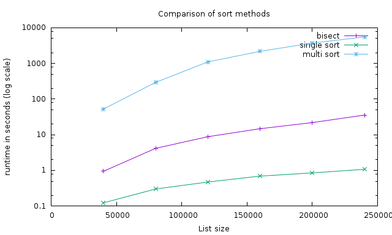

:css: css/style.css
:data-transition-duration: 500
:skip-help: true
:hovercraft-path: m275,175 v-150 a150,150 0 0,0 -150,150 z

----

The bisect module of
====================

the Standard Library
~~~~~~~~~~~~~~~~~~~~

RocPy, January 19th, 2016

- Presented by Ralph Bean
- http://github.com/ralphbean
- http://twitter.com/ralphbean
- http://threebean.org
- ``2048R/971095FF 2012-12-06``

- Slides: http://threebean.org/presentations/stdlib/bisect/

.. image:: images/creative-commons.png

----

A series
========

on the standard library
~~~~~~~~~~~~~~~~~~~~~~~

- You should really check out `Doug Hellman's Python Module of the Week
  <http://pymotw.com/2/>`_.   It was started as a way to build the habit of
  writing something on a regular basis. The focus of the series is building a
  set of example code for the modules in the Python standard library.

- I'm doing a running series of **talks** covering modules from the standard
  library that you may or may not know.  Doug already did this in blog form.
  I'd like to update and expand it where I can.

----

:data-x: r0
:data-y: r900

When you find yourself
======================
writing python
~~~~~~~~~~~~~~

- Its so easy to **write more** code to solve an abstraction problem, to handle
  a little pattern, or to smooth over some rough edge..

- On the other hand, there are **already a ton** of third-party modules available out
  there on the `Python Package Index <https://pypi.python.org>`_.  Search, and
  you'll find solutions to problems you didn't even know you had.

- Often though, the solution to our problem was **right there with us**, all
  along.  Right there in the standard library (stdlib).

----

:data-x: r1600
:data-y: 0

guess
=====
what the bisect module does
~~~~~~~~~~~~~~~~~~~~~~~~~~~

----

:data-x: r0
:data-y: r900

that's right!
=============
it bisects stuff!
~~~~~~~~~~~~~~~~~

----

You have two functions, and that's all (almost).

.. code:: python

    import bisect

    # Returns the position in `list` where `item` belongs.
    bisect.bisect(list, item)

    # Returns None, but it inserts `item` in `list` in position.
    bisect.insort(list, item)

----

:data-x: r0
:data-y: r900

how would you even
==================
use this?
~~~~~~~~~

.. code:: python

    """ Build a list of sorted values? """

    import bisect
    import random

    collection = []
    for i in range(1, 20):
        value = random.randint(1, 100)
        #position = bisect.bisect(collection, value)
        bisect.insort(collection, value)

----

The docs suggest that this is faster than sorting after every insert (which is
correct) and it suggests that it is even faster than doing on single
``.sort()`` at the end of the construction of a very large list (I'm not so
sure).

----

.. code:: python

    import bisect
    import random
    import time

    for magnitude in range(40000, 400000, 40000):
        print magnitude,

        # bisect
        start, list1 = time.time(), []
        for i in range(1, 2 * magnitude):
            bisect.insort(list1, random.randint(1, 10 * magnitude))
        print time.time() - start,

        # single sort
        start, list2 = time.time(), []
        for i in range(1, 2 * magnitude):
            list2.append(random.randint(1, 10 * magnitude))
        list2.sort()
        print time.time() - start,

        # multi sort
        start, list3 = time.time(), []
        for i in range(1, 2 * magnitude):
            list3.append(random.randint(1, 10 * magnitude))
            list3.sort()
        print time.time() - start

----

----

:data-x: r1600
:data-y: 0

if not that
===========
then what?
~~~~~~~~~~

It seems like this thing could be much more useful if the functions supported
an arbitrary ``cmp`` or ``key`` argument like the builtin ``sorted`` function
and the ``list.sort()`` method do.

Then, you could bisect collections of strange and non-standard objects, which could be fun.

----

:data-x: r1600
:data-y: 0

a look
======
under the hood
~~~~~~~~~~~~~~

This thing actually comes with both a pure-python implementation **and** a C implementation.

.. code::

    ~❯ wc -l /usr/lib64/python2.7/bisect.py
    92 /usr/lib64/python2.7/bisect.py

----

:data-x: r0
:data-y: r900

This is all it really boils down to.

.. code:: python

    def bisect_right(a, x, lo=0, hi=None):
        if lo < 0:
            raise ValueError('lo must be non-negative')
        if hi is None:
            hi = len(a)
        while lo < hi:
            mid = (lo+hi)//2
            if x < a[mid]: hi = mid
            else: lo = mid+1
        return lo

    bisect = bisect_right

``insort_right`` is more or less a copy/paste of this function.
And there are two left-handed versions of these same right-handed ones.

----

:data-x: r1600
:data-y: r0

This has been
=============

The bisect Module of the Standard Library
~~~~~~~~~~~~~~~~~~~~~~~~~~~~~~~~~~~~~~~~~~

RocPy, January 19th, 2016

- Presented by Ralph Bean
- http://github.com/ralphbean
- http://twitter.com/ralphbean
- http://threebean.org
- ``2048R/971095FF 2012-12-06``

- Slides: http://threebean.org/presentations/stdlib/bisect/

.. image:: images/creative-commons.png
